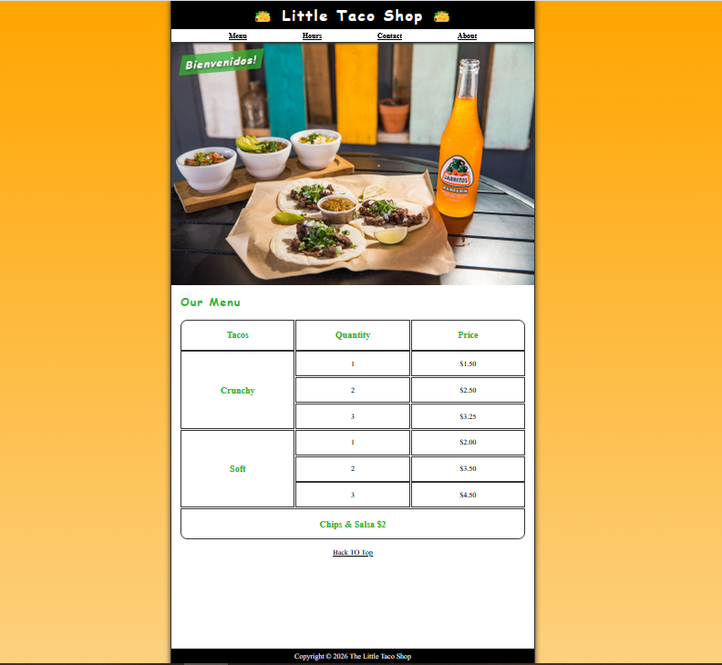
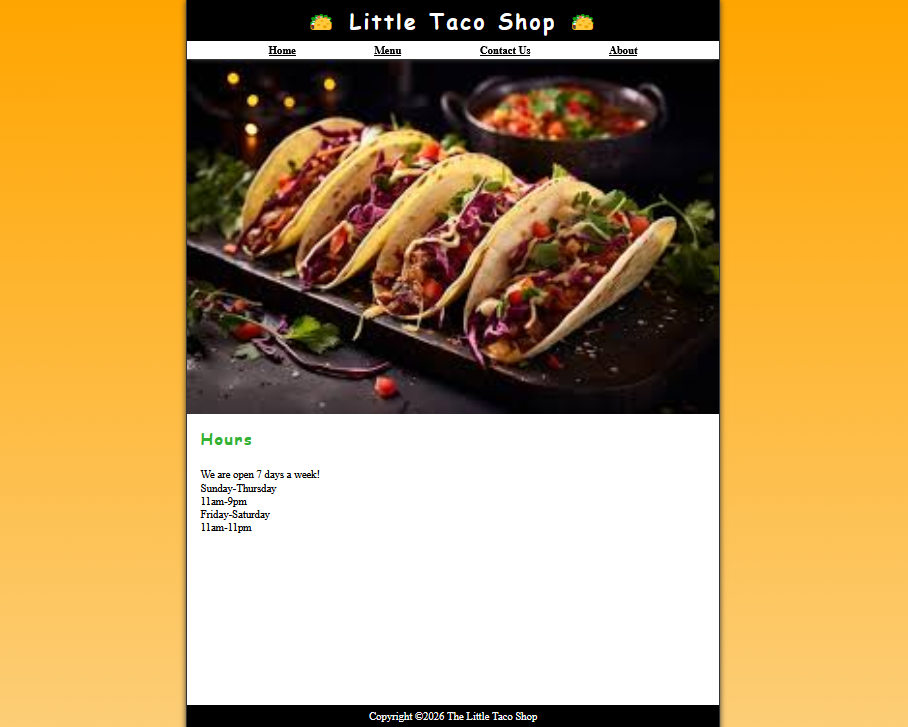
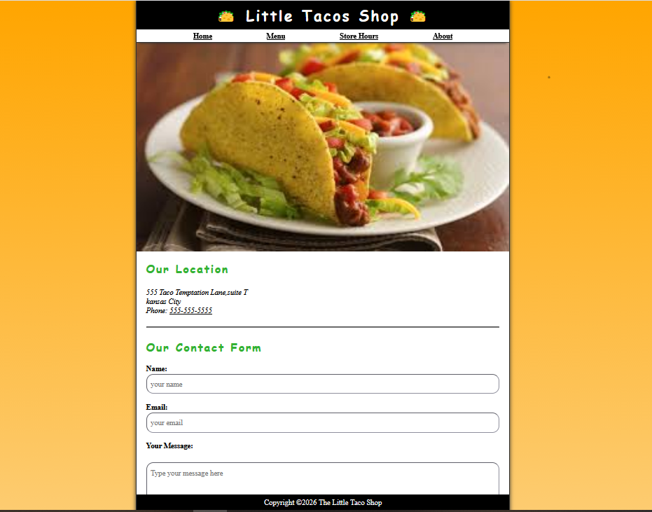
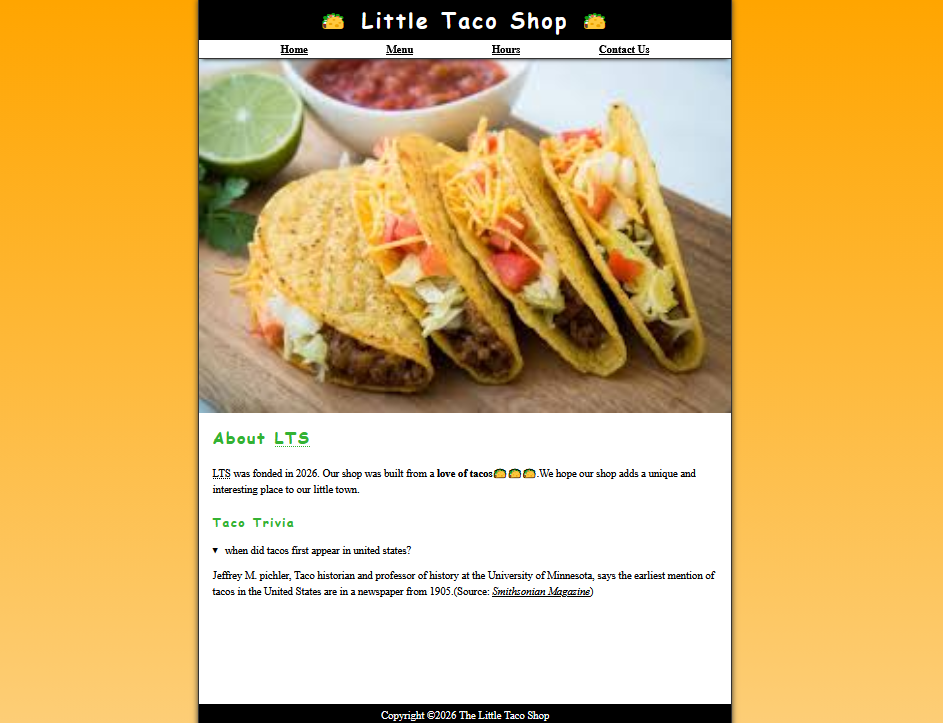

#🌮 Little Taco Shop Website
A simple static restaurant website built using HTML5 and CSS3.
This project represents a fictional taco restaurant and demonstrates basic frontend development concepts.
-------

##📖 Project Overview
The Little Taco Shop website contains multiple sections that simulate a real restaurant webpage.
It includes:
Home section
About the restaurant
Menu with prices
Store hours
Contact form
This project was created to practice structuring webpages and applying styles using only HTML and CSS (no JavaScript).
#🛠️ Technologies Used
HTML5 (Semantic elements)
CSS3 (Styling & layout)
----------------

#✨ Features
Simple and clean UI
Navigation bar for easy movement between sections
Menu table displaying items and prices
Contact form layout
Basic responsive design
------------
#📷 Screenshots
#HOME PAGE
 

#Hours Page

#Contact Form

#About Page

------------
🚀 How to Run Locally
Clone the repository
Open the project folder
Double-click index.html
The website will open in your browser.
🎯 What I Learned
Using semantic HTML tags
Styling webpages using CSS
Creating navigation between sections
Designing layout without frameworks
Structuring a small real-world website

## 🤝 Connect With Me
  Harshitha KC
  Computer Science Student
💼 LinkedIn:https://www.linkedin.com/in/harshitha-kc14
💻 GitHub:https://github.com/Harshithakc14

